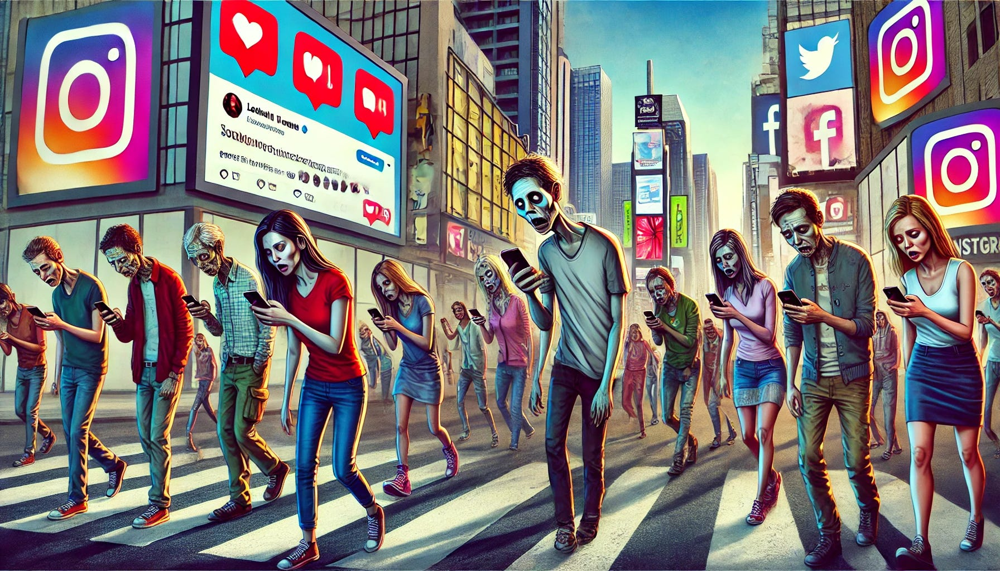

# Social media addiction

Project bookmarks:

-   [README](/README.md)
-   [Project board](https://github.com/users/StavSteven/projects/10)
-   [Raw data](/data/raw_data/student_social_media_addiction.csv) | [Clean data](/data/cleaned_data/student_social_media_addiction_cleaned.csv)
-   [ETL Jupyter Notebook](/jupyter_notebooks/1_data_cleaning_student_social_media_addiction.ipynb)
-   [Visualisation & Statistical analysis Notebook](/jupyter_notebooks/2_visualisations_student_social_media_addiction.ipynb)
-   [Machine Learning Notebook](/jupyter_notebooks/3_machine_learning.ipynb)
-   [Power BI dashboard](/dashboard/social_media_addiction_dashboard.pbix)
-   [Conclusion and discussion]()

## Contents

1. [Project Overview](#project-overview)
2. [Dataset Content](#dataset-content)
3. [Business Requirements](#business-requirements)
4. [Hypothesis Testing and Validation](#hypothesis-testing-and-validation)
5. [Rationale to map business requirements](#rationale-to-map-business-requirements)
6. [Analysis Techniques Used](#analysis-techniques-used)
7. [Development Roadmap](#development-roadmap)
8. [Libraries & External Software Used](#libraries--external-software-used)
9. [Conclusion and discussion](#conclusion-and-discussion)
10. [Limitations](#limitations)
11. [Credits](#credits)
12. [Acknowledgements](#acknowledgements)

## Project overview

This project focuses on exploring the relationship between an student's social media habits and their wider life, how does it affect their sleep, their mental health and does it have an effect on their academic studies and are they ready to accept that they're addicted to social media?

## Dataset Content

The student social media dataset was sourced from Kaggle: https://www.kaggle.com/datasets/adilshamim8/social-media-addiction-vs-relationships

It contains records of students ranging from 18-25, from all over the world. It records their social media usage, preferred platform, health and relationship dynamics.

| Field Name                     | Description                                                                               |
| ------------------------------ | ----------------------------------------------------------------------------------------- |
| `new_student_id`               | Unique identifier for each student in the dataset.                                        |
| `age`                          | Age of the student (in years).                                                            |
| `gender`                       | Gender of the student (e.g., Male, Female, Other).                                        |
| `relationship_status`          | Current relationship status (e.g., Single, In a Relationship, Married).                   |
| `academic_level`               | Student's education level (e.g., High School, Undergraduate, Graduate).                   |
| `country`                      | Country where the student resides.                                                        |
| `continents`                   | Continent corresponding to the student's country.                                         |
| `most_used_platform`           | Social media platform the student uses most frequently.                                   |
| `average_daily_usage_minutes`  | Average time spent on social media per day (in minutes).                                  |
| `average_daily_use_by_hour`    | Distribution of social media usage across hours of the day.                               |
| `sleep_per_night_minutes`      | Total sleep time per night (in minutes).                                                  |
| `sleep_hours_per_night`        | Total sleep time per night (in hours).                                                    |
| `conflicts_over_social_media`  | Indicates whether social media usage causes conflicts in personal relationships (Yes/No). |
| `affects_academic_performance` | Indicates whether social media usage negatively affects academic performance (Yes/No).    |
| `addicted_score`               | Score measuring the level of social media addiction (based on survey responses).          |
| `mental_health_score`          | Score measuring mental health status or impact (based on survey responses).               |

## Business requirements

There were no business requirements supplied with this dataset so I have created a scenario where the dataset has been provided by a health professional working in education providing wellbeing advice to students.
They have asked to find out how social media activity affects students academic performance, whether there are any other patterns that could provide causation for lower attainment levels and mental health scores. This could highlight a group of students that are at risk and could be targeted for intervention by their educational institution.

## Hypothesis and how to validate?

### Format:

-   Hypothesis:  
    H₀ -  
    H₁ -  
    _This will be tested by_

**Result:**

**_Business decision_**

---

-   **Hypothesis 1: Average daily use of social media will have a negative impact on sleep per night.**
    H₀ - Null hypothesis: There is no relationship between average daily social media use and sleep per night.
    H₁ - Alternative Hypothesis Higher average daily social media use has a negative impact on sleep per night.

_This will be tested statistically using spearman's rank and visualised on a scatter plot to see whether there is a relationship between the two values_

**Result:** We can reject the null hypothesis that there is no relationship between daily social media usage and sleep time.
**The correlation score between the two values was -0.81** meaning that in most cases as one value increased the other decreased. An increase in screen time resulted in sleep deficit which could have a knock on effect to academic studies and mental health score, leading to strained relationships with friends, family members and peers.
**With a pval < 0.05 (3.13 × 10⁻¹⁶⁶)** that is below the threshold of 0.05 to reject the null hypothesis and state that the relationship between the two values has not occured by chance.

**_Business decision_** There have been many wider studies that show the importance for any individual to get the required amount of sleep (between 6-9 hours per night), no less people in full time education studying for exams. We would recommend people try to cut down on time spent on social media by putting time limits on their apps or staying off their phone close to a sensibly scheduled bedtime.

---

-   **Hypothesis 2: An increased amount of conflicts over social media will lead to a lower mental health score**
    H₀ - Null hypothesis: There is no relationship between conflicts on social media and mental health score
    H₁ - Alternative Hypothesis Having a higher number of conflicts over social media will be associated to lower mental health scores

_This will be tested statistically using spearman's rank and visualised on a violin plot to determine whether there is a relationship between the two values_

**Result:** We can reject the null hypothesis that there is no relationship between an increase in social media conflicts having no bearing on mental health scores.
**The correlation score between the two values was -0.91.** This means there is strong correlation between the two values, individuals that find themselves getting into public spats on social media often see their mental health suffer as a result.
**With a pval < 0.05 (4.49 × 10⁻²⁶⁶)** we can reject the null hypothesis that there is no relationship between the two values.

**_Business decision_** Looking at the violin plot we can see that there is a horrible trend between the two values that as the number of conflicts increases, the range of mental health scores those people have gets progressively lower. The median jumps down an entire mental health score per extra argument, so it pays to use the block button or take timeout instead of getting irate over social media. Lower mental health scores may have consequences beyond social media so it isn't worth getting involved in online spats.

---

-   **Hypothesis 3: TikTok users will have the lowest mental health scores**
    H₀ - Null hypothesis: There is no distinction to be made between the mental health score of TikTok users in comparison to other social media platforms
    H₁ - Alternative Hypothesis TikTok users have a lower mental health score than users who used alternative platforms as their main source of social media

_This will be tested statistically using a Kruskal–Wallis test to compare mental health scores across platforms, supported by a Chi-Square test to examine whether academic performance impact differs between platforms. A Plotly bar chart with line overlay was used to visualise user counts, mental health scores, and reported academic effects._

For this hypothesis, the analysis focused on the three platforms with the largest user counts (TikTok, Instagram, Facebook). Other platforms were excluded from statistical testing due to insufficient sample sizes and unstable average mental health scores.

**Result:** We can reject the null hypothesis as at least one platform differs significantly in mental health scores, supporting the observation that TikTok users experience lower wellbeing.
**The Kruskal-Wallis test returned a H value of 58.90 & pval < 0.05 (1.62 × 10⁻¹³)** together demonstrate that there are differences between the platform user's mental health scores that are far too large to be random variation. The larger the H value indicates stronger evidence that at least one group differs.
As I have included whether specific platforms have effected academic performance on the plot then it made sense to carry out a statistical test on that too.
**The Chi-Square test returned a χ² value of 257.82 & pval < 0.05 (6.43 × 10⁻⁴⁹)** This result means that there is link between platform and impact on academic studies. That TikTok users are far more likely to report an impact on their studies than users of other social media sites. TikTok users demonstrated both the lowest mental health scores and the highest rate of reported academic impact (93.46%), compared with (68.95%) for Instagram and (30.08%) for Facebook, where a majority of users reported no academic effects. This pattern strongly supports the initial hypothesis.

**_Business decision_** Based on the strong association between TikTok use, reduced mental health scores, and frequent reports of academic disruption, it would be advisable for wellbeing and academic support teams to consider targeted interventions for heavy TikTok users, pointing students in the direction of wellbeing services to raise awareness of the importance of balance between online and offline. Reducing excessive TikTok consumption may help improve both mental wellbeing and academic performance.

---

-   **Hypothesis 4: Addiction level has an impact on sleep duration**
    H₀ – Null hypothesis: Addiction level has little to no impact on sleep duration.
    H₁ – Alternative hypothesis: Higher addiction levels will reduce sleep duration.

_This will be tested statistically using Spearman’s rank correlation to assess the relationship between addiction level and sleep duration. The relationship will also be visualised using a combined boxplot and strip plot to show both the distribution and individual data points._

A strip plot was used to show each user’s sleep duration against their addiction score. Because this created a dense cluster of datapoints, a boxplot was added in the background to highlight the median and interquartile ranges for each sleep-duration group.

**Result:** We can reject the null hypothesis, as the data demonstrates that sleep duration decreases as addiction levels rise.
**The correlation score between the two values was -0.79**, indicating a strong negative relationship: individuals with higher addiction levels consistently report fewer hours of sleep.
**With a pval < 0.05 (2.44 × 10⁻¹⁴⁸)** far below the significance threshold there is extremely strong evidence that elevated social media addiction levels are associated with reduced sleep duration. The visualisation supports this finding, showing that users sleeping fewer than 5 hours per night cluster around higher addiction scores with a narrower range, while those sleeping more exhibit lower and more varied addiction levels.

**_Business decision_** Given the strong negative association between addiction levels and sleep duration, wellbeing and academic support teams should consider targeted guidance to help students manage excessive social media use, particularly late-night scrolling. Recommendations may include digital curfews, app timers, or structured bedtime routines. Improving sleep hygiene for highly addicted users could support better mental health, higher academic performance, and overall wellbeing.

---

# Summary of findings v hypothesis

| Hypothesis                                     | Statistical Test            | Statistic / Correlation | p-value       | Interpretation / Result                             |
| ---------------------------------------------- | --------------------------- | ----------------------- | ------------- | --------------------------------------------------- |
| H1: Higher daily social media use → less sleep | Spearman's rank correlation | ρ = -0.813              | 3.13 × 10⁻¹⁶⁶ | Strong negative correlation, reject H₀              |
| H2: More conflicts → lower mental health       | Spearman's rank correlation | ρ = -0.908              | 4.49 × 10⁻²⁶⁶ | Strong negative correlation, reject H₀              |
| H3: TikTok users have lowest mental health     | Kruskal–Wallis H-test       | H = 58.90               | 1.62 × 10⁻¹³  | Significant difference between platforms, reject H₀ |
| H4: Higher addiction → less sleep              | Spearman's rank correlation | ρ = -0.786              | 2.44 × 10⁻¹⁴⁸ | Strong negative correlation, reject H₀              |

---

## Project plan

This project followed a structured data analytics workflow designed to ensure the dataset was handled consistently from collection through to interpretation, implementing data analysis best practices, GDPR regulation and taking an ethical approach to handling the data. The steps below outline the process and the rationale behind each stage.

### 1. Data Collection

-   The dataset was sourced from Kaggle and downloaded as a CSV file.
-   The only field that could be used to identify an individual was the student ID so these were modified during the data transformation stage to protect anonyminity.
-   The dataset contained demographic details, social media usage metrics, addiction scores, mental health scores, and behavioural indicators such as sleep duration and academic impact.

### 2. Data preparation

-   Loaded and inspected the dataset using pandas
-   Checked for missing values, duplicates, and inconsistencies in categorical fields.
-   Standardised column names and data types for ease of use.
-   Created additional calculated fields (e.g., converting minutes to hours).

### 3. Exploratory data analysis (EDA)

-   Generated summary statistics and visualised distributions to understand the shape of the data and outliers.
-   Explored initial relationships using scatter plots, violin plots and strip plots
-   This stage helped guide which hypotheses to test and confirmed that non-parametric methods were more suitable due to skewed data and inconsistent group sizes.

### 4. Hypothesis testing and statistical analysis

-   Used statistical tests such as Spearman’s rank, Kruskal–Wallis and Chi-Square tests to assess relationships and comparisons amongsts different fields in the dataset.
-   These were selected because they do not assume normality and are appropriate for survey-based, unevenly distributed data.

### 5. Intepretation of findings

-   Created user friendly plots using Seaborn, Matplotlib and Plotly, including boxplots, scatter plots, violin plots, and bar charts.
-   Visualisations were used alongside statistical output to provide intuitive explanations of trends.
-   Dashboard created to allow business user to drill down on specific variables to visualise their own findings.
-   Combined statistical and visual elements to provide evidence of findings to reject null hypotheses.
-   Compared findings to identify consistent trends within clusters of points in ml learning model

### 6. Reporting and documentation

-   Consolidated analysis into a structured README with clear sections for hypotheses, methodology, results, limitations, and business decisions.
-   Ensured all steps were reproducible by documenting the code workflow and visual outputs.

### 7. Justifications of methodology

-   The dataset consists mainly of ordinal and non-normal distributions, meaning non-parametric tests (Spearman, Kruskal–Wallis, Chi-Square) are appropriate.
-   Correlation tests were chosen to quantify direction and strength of relationships identified in EDA.
-   Group-comparison tests were selected where platform-based behavioural differences were expected.
-   Visual methods (strip plots, boxplots, violin plots) were chosen because they communicate both the distribution and concentration of responses clearly, especially for survey datasets.
-   The combination of statistical tests and visual analysis ensured findings were interpretable by both technical and non technical users

---

## Rationale to map business requirements

This project’s data visualisations were designed to support the wellbeing professional’s core business requirements by transforming the dataset into meaningful, actionable insights. Each visual was selected to answer a specific analytical question related to student mental health, sleep quality, social media behaviour, and academic impact.

Below is an outline of each requirement and the rationale behind the chosen visual approach.

### 1. Identify and visualise factors that negatively affect student wellbeing and academic performance

Visualisations used:

-   Scatterplots (e.g., social media usage vs. sleep duration)
-   Correlation analysis heatmaps
-   Violin and box plots showing mental health distributions
-   Strip plots illustrating addiction levels across sleep categories

Rationale:
These visuals make it possible to pinpoint which behaviours strongly associated with poor sleep, lower mental health, or academic disruption. These include heavy social media use, addiction score, frequency of conflicts.
The combination of correlations and distribution-based plots highlights both strength and shape of these relationships, helping the wellbeing professional understand the root drivers of risk to student's health and academic attainment.

### 2. Provide actionable wellbeing insights for educational stakeholders

Visualisations used:

-   Mental health vs. conflict violin plots
-   Addiction vs. sleep duration combined box/strip plots
-   Scatterplots showing sleep deficits linked to excessive usage

Rationale:
These visualisations clearly illustrate patterns that have practical wellbeing implications—such as students losing sleep due to excessive social media use or experiencing deteriorating mental health following repeated online conflicts. This allows wellbeing advisors to make evidence-based recommendations, such as digital curfews, support interventions, or student guidance initiatives.

### 3. Compare trends across different social media platforms

Visualisations used:

-   Bar charts comparing mental health and academic impact across TikTok, Instagram, and Facebook
-   Platform-based score distributions
-   Statistical test (Kruskal–Wallis and Chi-Square)

Rationale:
Platform-level comparisons reveal behavioural and wellbeing differences between user groups, highlighting TikTok users as statistically more vulnerable (lower mental health scores and higher academic disruption). These visuals help stakeholders identify which student segments may require the most targeted support.

### 4. Enable exploration of student behaviour across demographics and wellbeing indicators

Visualisations used:

-   Dashboard (Power BI) with filters for academic level, most used platform country, gender, relationship status
-   Line charts, bar charts, and scatterplots that react dynamically to filters

Rationale:
Interactive filtering allows wellbeing teams and educators to explore patterns across demographic groups or behavioural subgroups—helping them understand whether certain populations face disproportionate risks.
This supports scenario-based insights, enabling institutions to tailor interventions to specific student communities.

### 5. Communicate complex behavioural relationships in an accessible way

Visualisations used:

-   Cleanly annotated scatterplots
-   Intuitive distribution plots (violin, box, strip)
-   Colour-coded bar charts for platform comparisons
-   Dashboard with user-friendly drill-down options

Rationale:
Because the final users may not have statistical or analytical expertise, each visual was designed to be intuitive and self-explanatory. Annotated plots and straightforward layouts communicate findings clearly, supporting fast interpretation without requiring technical background knowledge.

### Summary

Every visualisation in this project was chosen not only to support rigorous statistical analysis, but also to make the findings accessible, interpretable, and actionable for stakeholders in an educational wellbeing context. The mapping from business requirement to visual to insights ensures that each output directly contributes to understanding and improving the wellbeing and academic success of students.

---

## Data Analysis Methods Used

### Exploratory Data Analysis (EDA)

-   Summary statistics (mean, median, variance)
-   Distribution analysis with histograms and KDE plots
-   Transforming the data
-   Dealing with problem values (nulls and duplicates)
-   Initial relationship exploration using scatterplots, violin plots, and boxplots

### Statistical Analysis

-   Spearman's rank to evaluate relationships between variables
-   Kruskal–Wallis test for comparing scores across platforms
-   Chi-Squared test for categorical associations

### Visual Statistics

-   Scatterplots
-   Violin, strip, and box plots
-   Bar charts and histograms
-   Interactive dashboard

### Machine Learning

-   Pipeline for preprocessing and modelling
-   Dimensionality reduction using PCA
-   Clustering (KMeans)
-   Elbow method and silhouette score
-   Cluster profiling

Note:
No supervised ML models were used as the dataset did not include a target variable.
All analysis focused on pattern discovery rather than prediction.

### Limitations of the Dataset

-   Many variables were ordinal, making parametric tests (like Pearson correlation) inappropriate.
-   Uneven group sizes (e.g., TikTok vs. other platforms) reduced reliability of comparisons.
-   Self-reported values (sleep, mental health, addiction) introduced bias.
-   Dataset captured only a single point in time per student — no causal inference possible.
-   No long-term behaviour tracking, academic grades, or medical/clinical data.
-   Some platforms had extremely small sample sizes, preventing reliable statistical testing.

### Alternative Approaches With Better Data

-   Pearson correlation or linear regression if data were continuous and normally distributed.
-   ANOVA for group comparisons if group sizes were balanced.
-   Time-series analysis if behaviour were tracked over multiple days or weeks.

## How Generative AI Tools Supported Ideation, Design Thinking, and Code Optimisation

### Code Optimisation

-   Suggested more efficient approaches to certain pandas operations.
-   Automated repetitive coding tasks through mapping and vectorised operations.
-   Improved plot readability (colour schemes, axis labelling, layout tweaks).
-   Recommended additional statistical tests appropriate for ordinal data.
-   Helped debug common errors during EDA and visualisation (especially Plotly).

### Documentation & Communication

-   Assisted with ideation and framing of hypotheses.
-   Helped refine research questions and business requirements.
-   Improved clarity, technical tone, and flow across documentation and README.

---

## Ethical considerations

-   Dataset was publically available on kaggle
-   The dataset contained no information that could be used to trace any individual
-   Data was used for research and analysis only. There were no GDPR violations
-   Student identifiers were modified during cleaning phase
-   Values were self reported so values such as mental health score, affected academic studies, addiction scores could be inaccurate
-   The dataset features some students as the sole participant from that country
-   Social media platforms weren't equally represented and other categorical imbalances were present
-   As a result wellbeing decisions should not be made solely from clustering, they are behavioural patterns not a diagnosis of any individual
-   Limitations in the dataset have been documented
-   Use of AI has been documented througout the project
